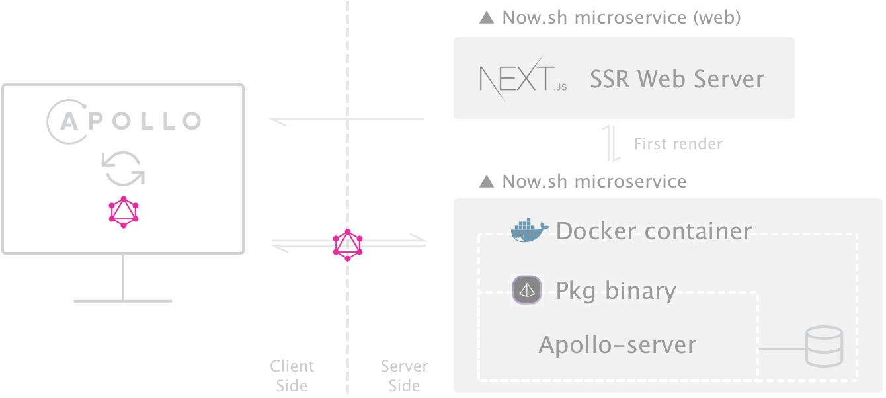
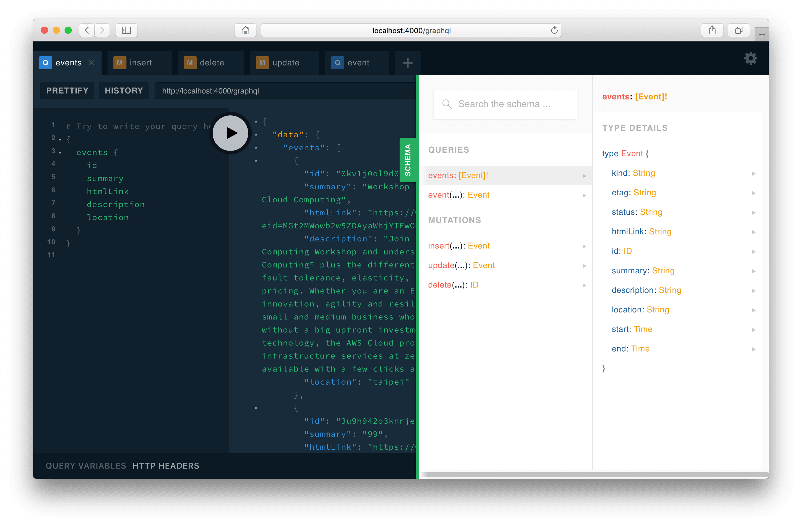
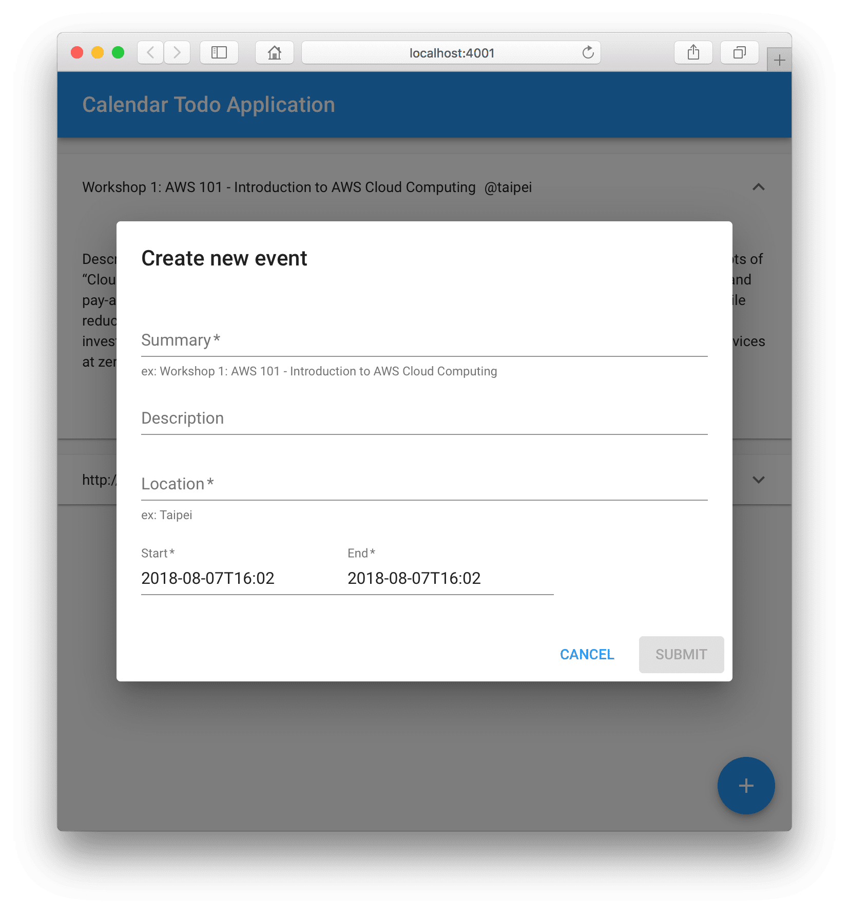

# Calendar-todo

> Google calendar todo list application with GraphQL proxy.

## Demo

There are two micro-services in this application:

1. [GraphQL Server](#graphql-server): GraphQL proxy to Google calendar API
2. [Web](#web-server): Website portal



## Usage

```shell
$ cp docker-compose.example.yml docker-compose.yml
# Please update your own config

$ docker-compose run server
# Enter the code...

$ docker-compose up web
```

## Technology Stack

- Apollo server 2 - GraphQL proxy server
- Next.js - React Server side render
- Apollo client
- Material-ui
- Docker & Pkg - binary in docker

## Development

- node >= v10.7.0
- yarn >= 1.9.4

### Get Google API Key

https://cloud.google.com/docs/authentication/api-keys?hl=en&
visit_id=1-636689598307138596-4038797601&rd=1

### GraphQL server

Option 1: Dev Server

```shell
$ cd packages/server
$ cp .env.example .env # input your own config
$ npm run dev # dev server
> 🚀 Server ready at http://localhost:4000/graphql
```

Option 2: Build with dockerfile

```shell
$ docker build -t calendar-todo/server .
$ docker run --rm -it \
  -p 4000:4000 \
  -e "NODE_ENV=production" \
  -e "PORT=4000" \
  -e "DEBUG=server" \
  -e "GOOGLE_CLIENT_ID=927669772833-ou0jjulc4p68dbfmfnltjqk83rgd5mtr.apps.googleusercontent.com" \
  -e "GOOGLE_CLIENT_SECRET=jmn2fzU9n55PIX6FwswyWcDV" \
  -e "GOOGLE_REDIRECT_URL=urn:ietf:wg:oauth:2.0:oob" \
  calendar-todo/server
```

Screenshot:



### Web server

Option 1: Dev Server

```shell
$ cd packages/web
$ cp .env.example .env # input your own config
$ npm run dev # dev server
> Ready on http://localhost:4001
```

Option 2: Build with dockerfile

```shell
$ docker build -t calendar-todo/web .
$ docker run --rm -it \
  -p 4001:4001 \
  -e "NODE_ENV=production" \
  -e "PORT=4001" \
  -e "DEBUG=web" \
  -e "API_DOMAIN=http://localhost:4000/graphql" \
  calendar-todo/web
```

Screenshot:


